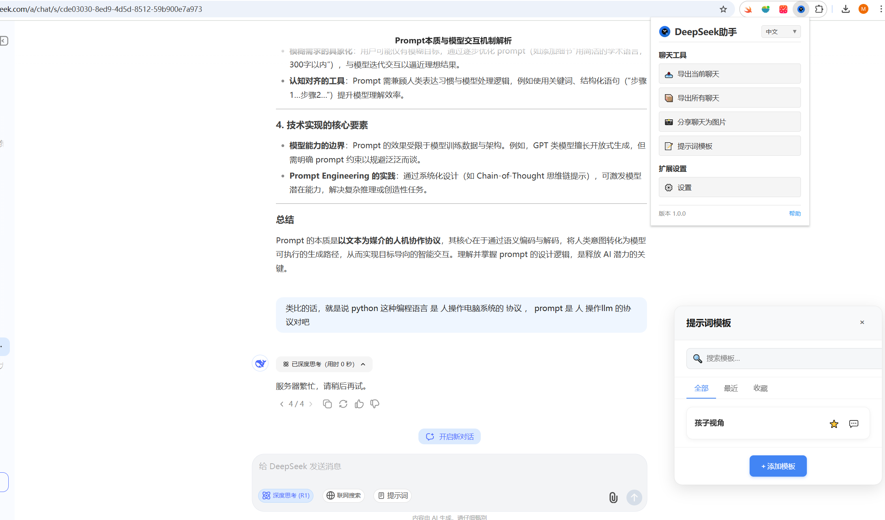
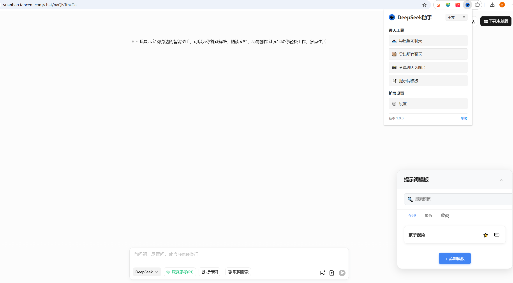
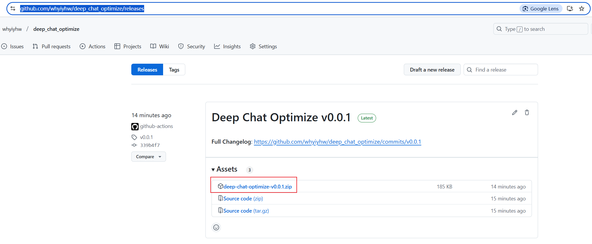
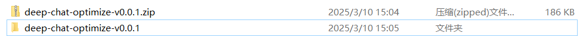
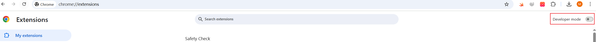

# 项目 为 deep chat optimize

- 已实现功能
- [x] 对于浏览器上的 ai chat 的 界面优化，加入额外功能，
- [x] 对于浏览器上的 chat 数据可以进行 导出 方便用户 进行 本地化的存储 或者进行分享到社交平台。
- [x] 支持通过GitHub Actions自动构建和发布扩展包

## 支持的网站

目前支持以下AI聊天网站：
- DeepSeek Chat (https://chat.deepseek.com/)
- 腾讯元宝 (https://yuanbao.tencent.com/)

## 支持的浏览器
- Chrome
- 安装
  - 下载 zip 文件 [release](https://github.com/whyiyhw/deep_chat_optimize/releases)
  
  - 解压到本地
  
  - 打开浏览器，访问 `chrome://extensions/`
  
  - 打开开发者模式
  - 点击 "加载已解压的扩展程序"
  - 选择解压后的文件夹
  - 点击 "确定"

## 功能特性

### 界面优化
- 自定义主题和布局
- 代码高亮显示
- 响应式设计，适配不同设备

### 额外功能
- 历史会话管理
- 提示词（Prompt）模板管理
- 多模型支持和切换
- 图像渲染和处理

### 数据导出
- 支持多种格式导出（JSON、Markdown）
- 一键导出当前会话
- 批量导出历史会话
- 图像导出功能

> 开发相关内容已移至 [开发指南](./doc/develop.md)

## 许可证

本项目采用 MIT 许可证 - 详情请参阅 [LICENSE](LICENSE) 文件
